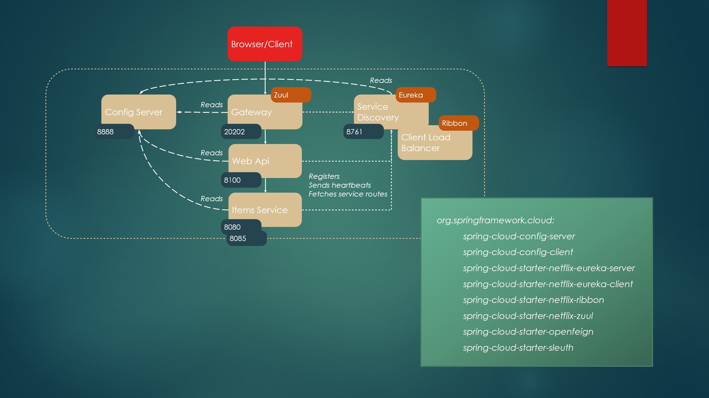

== Application links

=== config server

http://localhost:8888/actuator/health

http://localhost:8888/service-discovery-server/native

http://localhost:8888/webapi/native

http://localhost:8888/items-service/native

http://localhost:8888/reviews-service/native

http://localhost:8888/webapi/native

http://localhost:8888/gateway/native

=== service-discovery-server

http://localhost:8761

=== items-service

http://localhost:8761/eureka/apps/items-service

http://localhost:8080/h2-console (use JDBC URL: jdbc:h2:mem:testdb, user: sa, password: empty (leave blank)

http://localhost:8080/items and http://localhost:8080/items/1

=== items-review

http://localhost:8761/eureka/apps/reviews-service

http://localhost:8080/h2-console (use JDBC URL: jdbc:h2:mem:testdb, user: sa, password: empty (leave blank)

http://localhost:8080/reviews

http://localhost:8080/reviews/item

http://localhost:8080/reviews/item/1

=== webapi

http://localhost:8100/webapi/items and http://localhost:8100/webapi/items/1

=== gateway

http://localhost:20202/items and http://localhost:20202/items/1

http://localhost:20202/actuator/env (See https://docs.spring.io/spring-boot/docs/current/reference/html/production-ready-endpoints.html for available actuator enpoints)

== Externa links

Spring initialzr: https://start.spring.io/

Spring boot home: https://spring.io/projects/spring-boot

Spring Cloud Netflix reference (Eureka, Ribbon, Hysterix, Zuul): https://cloud.spring.io/spring-cloud-static/spring-cloud-netflix/2.1.0.RELEASE/single/spring-cloud-netflix.html

Spring Cloud Config reference: https://cloud.spring.io/spring-cloud-static/spring-cloud-config/2.1.0.RELEASE/single/spring-cloud-config.html

Spring Cloud OpenFeign reference: https://cloud.spring.io/spring-cloud-static/spring-cloud-openfeign/2.1.0.RELEASE/single/spring-cloud-openfeign.html

Spring Cloud Sleuth reference: https://cloud.spring.io/spring-cloud-static/spring-cloud-sleuth/2.1.0.RELEASE/single/spring-cloud-sleuth.html
